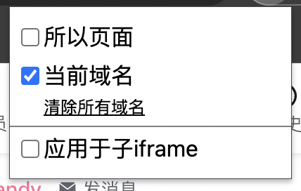
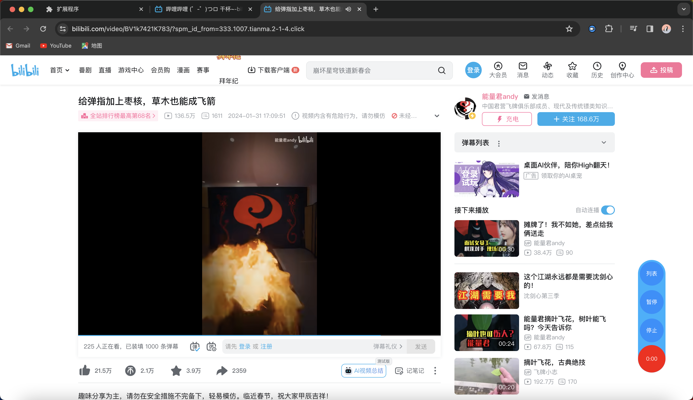
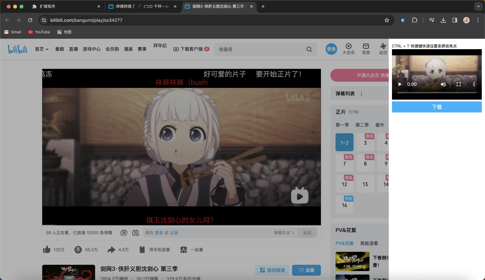

# 视频网站录制扩展程序

使用于想要快速获取适配素材又不想下载整个适配的场景

## 特点

- 对页面video标签进行录制
- 好的录制开始、中断、恢复机制，如：开始录制自动播放、差网自动中断录制、恢复播放同时恢复录制、播放自动停止录制、快捷选择停止录制时间点等
- 动态适配码率，720p/1080p/2k/4k 的码率动态适配 2Mb/4Mb/8Mb/16Mb
- 好的录制功能插入机制，有视频播放的页面加载插件、可指定域名加载插件、可以了录制iframe适配

## 注意

码率相对固定，对于视频只要求较高的场景还是老实下载原视频
